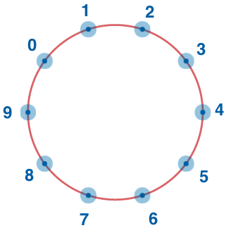

## Description
------

[The Core - Home](../../code-signal-arcade-thecore/README.html)

[29. Chess Board Cell Color](../29_chessBoardCellColor/README.html) | [31. Deposit Profit](../31_depositProfit/README.html)

[Alt/rust](./Alt_rust/README.md) | [Alt/js](./Alt_js/README.html) | [Alt/py3](./Alt_py3/README.md) | [Alt/cpp](./Alt_cpp/README.md) | [Alt/c](./Alt_c/README.md)

Consider integer numbers from <code>0</code> to <code>n - 1</code> written down along the circle in such a way that the distance between any two neighbouring numbers is equal (note that <code>0</code> and <code>n - 1</code> are neighbouring, too).

Given <code>n</code> and <code>firstNumber</code>, find the number which is written in the radially opposite position to <code>firstNumber</code>.

**Example**

For <code>n = 10</code> and <code>firstNumber = 2</code>, the output should be
<code>circleOfNumbers(n, firstNumber) = 7</code>.

**Input/Output**

* **[execution time limit] 4 seconds (js)**

* **[input] integer n**

A positive **even** integer.

*Guaranteed constraints*:
<code>4 ≤ n ≤ 20</code>.

* **[input] integer firstNumber**

*Guaranteed constraints*:
<code>0 ≤ firstNumber ≤ n - 1</code>.

* **[output] integer**

**[JavaScript (ES6)] Syntax Tips**


// Prints help message to the console
// Returns a string
function helloWorld(name) {
    console.log("This prints to the console when you Run Tests");
    return "Hello, " + name;
}


## Solution
------







