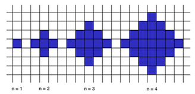

## Description
------

[The Core - Home](../../code-signal-arcade-thecore/README.html)

[4. Adjacent elements product](../4_adjacentElementsProduct/README.html)  | [6. home](../6_makeArrayConsecutive2/README.html)

[Alt/rust](./Alt_rust/README.md) | [Alt/js](./Alt_js/README.html) | [Alt/py3](./Alt_py3/README.md) | [Alt/cpp](./Alt_cpp/README.md) | [Alt/c](./Alt_c/README.md)

Below we will define an <code>n</code>-interesting polygon. Your task is to find the area of a polygon for a given <code>n</code>.

A <code>1</code>-interesting polygon is just a square with a side of length <code>1</code>. An n-interesting polygon is obtained by taking the <code>n - 1</code>-interesting polygon and appending <code>1</code>-interesting polygons to its rim, side by side. You can see the <code>1</code>-, <code>2</code>-, <code>3</code>- and <code>4</code>-interesting polygons in the picture below.

**Example**

* For <code>n = 2</code>, the output should be
<code>shapeArea(n) = 5</code>;
* For <code>n = 3</code>, the output should be
<code>shapeArea(n) = 13</code>.

**Input/Output**

* **[execution time limit] 4 seconds (js)**

* **[input] integer n**

*Guaranteed constraints*:
<code type='math/tex'>1 \leq \text{n} \le 10^4</code>.

* **[output] integer**

The area of the <code>n</code>-interesting polygon.

**[JavaScript (ES6)] Syntax Tips**


// Prints help message to the console
// Returns a string
function helloWorld(name) {
    console.log("This prints to the console when you Run Tests");
    return "Hello, " + name;
}


## Solution
------







